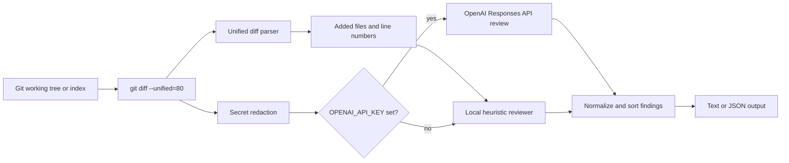

# Terminal Code Reviewer

Terminal Code Reviewer is a TypeScript CLI for reviewing local git diffs before they reach a pull request. It reads `git diff`, maps findings back to changed files and new-line numbers, redacts common secret patterns, then reviews the diff with either deterministic local heuristics or the OpenAI Responses API.

It is built for developers who prefer terminal-first workflows, maintainers who want a lightweight second pass before review, and teams that need machine-readable self-review output without sending every change to a hosted code-review product.

## Use cases

- Run a quick self-review before committing working-tree changes.
- Review staged changes in a pre-commit or pre-push workflow.
- Check a branch against `origin/main` before opening a pull request.
- Limit review to risky areas such as `src/`, config files, or package manifests.
- Emit JSON for scripts that fail on high-severity findings or attach results to CI logs.

## How it works



The CLI builds a `git diff` command from the selected scope. By default it reviews the working tree; `--staged` switches to `git diff --cached`, `--base <ref>` compares against a base ref, and repeated `--path <path>` values add path filters after `--`.

The parser reads unified diff hunks, keeps only added lines, and records each finding against the new version of the file. The redactor runs before model review and replaces common environment assignments, bearer tokens, OpenAI-style keys, code-level `password`/`token`/`secret` assignments, and long token-like strings.

When `OPENAI_API_KEY` is not set, the local heuristic reviewer flags common hazards: committed secrets, logged secrets, console logging, dynamic code execution, shell execution, focused tests, empty catch blocks, and static-analysis suppressions. When `OPENAI_API_KEY` is set, the redacted diff is sent to OpenAI with a strict JSON schema so findings come back as structured `file`, `line`, `severity`, `title`, `message`, and `recommendation` records.

## Setup

Requirements:

- Node.js 20.19 or newer.
- Git available on `PATH`.
- An OpenAI API key only if you want model-backed review.

Install dependencies and build the CLI:

```bash
npm ci
npm run build
```

Optional OpenAI configuration:

```bash
cp .env.example .env.local
```

Then edit `.env.local`:

```dotenv
OPENAI_API_KEY=your_api_key_here
OPENAI_MODEL=gpt-5.5
```

Leave `OPENAI_API_KEY` blank or omit `.env.local` to keep review fully local with the heuristic reviewer. `.env`, `.env.local`, and other `.env.*` files are ignored; `.env.example` is the only env file intended for version control.

## Commands

From this repository after `npm run build`:

```bash
node dist/cli.js --help
node dist/cli.js
node dist/cli.js --staged
node dist/cli.js --base origin/main
node dist/cli.js --path src --path package.json
node dist/cli.js --format json
node dist/cli.js --min-severity high
```

After installing or linking the package, the same CLI is available as:

```bash
terminal-code-reviewer --staged --min-severity high
```

Development and readiness checks:

```bash
npm run lint
npm run typecheck
npm test
npm run build
npm audit --audit-level=moderate
npm outdated
```

## Options

| Option | Description |
| --- | --- |
| `--staged` | Review staged changes with `git diff --cached`. |
| `--base <ref>` | Review changes against a base ref such as `origin/main`. |
| `--path <path>` | Limit review to a path. Repeat for multiple paths. Positional paths are also accepted. |
| `--format <text\|json>` | Choose human-readable text or stable JSON output. |
| `--min-severity <level>` | Filter output to `critical`, `high`, `medium`, or `low` and above. |
| `-h`, `--help` | Show CLI help. |
| `-v`, `--version` | Show the CLI version. |

## Codebase structure

```text
src/cli.ts                  CLI argument parsing, env loading, reviewer selection
src/diff.ts                 git diff argument building and unified diff parsing
src/redaction.ts            best-effort secret redaction before OpenAI review
src/heuristic-reviewer.ts   local deterministic rules
src/openai-reviewer.ts      OpenAI Responses API reviewer and JSON schema
src/findings.ts             finding normalization, severity filtering, sorting
src/formatter.ts            text and JSON output formatting
tests/                      Vitest coverage for parser, reviewer, formatter, CLI
.github/workflows/ci.yml    lint, typecheck, test, build, audit, outdated checks
.github/dependabot.yml      npm and GitHub Actions dependency update checks
.env.example                safe, non-secret configuration template
```

## Privacy and security notes

- Without `OPENAI_API_KEY`, the CLI does not call OpenAI and reviews only with local heuristics.
- With `OPENAI_API_KEY`, the redacted diff is sent to OpenAI for review. Redaction is best-effort and should not be treated as a data-loss-prevention boundary.
- The raw diff remains local for parsing and heuristic checks, but avoid running any review tool on diffs that contain real secrets.
- Secret-like values are replaced before model review, including OpenAI-style keys, bearer tokens, env assignments, and code assignments to names such as `password`, `token`, `secret`, and `apiKey`.
- Local env files are ignored by git. Do not commit `.env`, `.env.local`, npm tokens, API keys, or review logs.
- The diff collector uses `execFile` with argument arrays instead of shell string execution.
- CI runs lint, typecheck, tests, build, `npm audit --audit-level=moderate`, and `npm outdated`. Dependabot is configured for npm packages and GitHub Actions.
