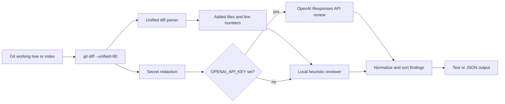

# Architecture

Terminal Code Reviewer reads `git diff`, maps findings back to changed files and new-line
numbers, redacts common secret patterns, then reviews the diff with either deterministic
local heuristics or the OpenAI Responses API.

Diagram source: [architecture.mmd](architecture.mmd).

## Flow

The CLI builds a `git diff` command from the selected scope. By default it reviews the
working tree; `--staged` switches to `git diff --cached`, `--base <ref>` compares against
a base ref, and repeated `--path <path>` values add path filters after `--`.

The parser reads unified diff hunks, keeps only added lines, and records each finding
against the new version of the file. The redactor runs before model review and replaces
common environment assignments, bearer tokens, OpenAI-style keys, code-level
`password`/`token`/`secret` assignments, and long token-like strings.

When `OPENAI_API_KEY` is not set, the local heuristic reviewer flags common hazards:
committed secrets, logged secrets, console logging, dynamic code execution, shell
execution, focused tests, empty catch blocks, and static-analysis suppressions. When
`OPENAI_API_KEY` is set, the redacted diff is sent to OpenAI with a strict JSON schema so
findings come back as structured `file`, `line`, `severity`, `title`, `message`, and
`recommendation` records.

## Modules

| Path | Role |
| --- | --- |
| `src/cli.ts` | CLI argument parsing, env loading, reviewer selection |
| `src/diff.ts` | git diff argument building and unified diff parsing |
| `src/redaction.ts` | best-effort secret redaction before OpenAI review |
| `src/heuristic-reviewer.ts` | local deterministic rules |
| `src/openai-reviewer.ts` | OpenAI Responses API reviewer and JSON schema |
| `src/findings.ts` | finding normalization, severity filtering, sorting |
| `src/formatter.ts` | text and JSON output formatting |
| `tests/` | Vitest coverage for parser, reviewer, formatter, CLI |
| `.github/workflows/ci.yml` | lint, typecheck, test, build, audit, outdated checks |
| `.github/dependabot.yml` | npm and GitHub Actions dependency update checks |
| `.env.example` | safe, non-secret configuration template |

## Privacy and security notes

- Without `OPENAI_API_KEY`, the CLI does not call OpenAI and reviews only with local heuristics.
- With `OPENAI_API_KEY`, the redacted diff is sent to OpenAI for review. Redaction is best-effort and should not be treated as a data-loss-prevention boundary.
- The raw diff remains local for parsing and heuristic checks, but avoid running any review tool on diffs that contain real secrets.
- Secret-like values are replaced before model review, including OpenAI-style keys, bearer tokens, env assignments, and code assignments to names such as `password`, `token`, `secret`, and `apiKey`.
- Local env files are ignored by git. Do not commit `.env`, `.env.local`, npm tokens, API keys, or review logs.
- The diff collector uses `execFile` with argument arrays instead of shell string execution.
- CI runs lint, typecheck, tests, build, `npm audit --audit-level=moderate`, and `npm outdated`. Dependabot is configured for npm packages and GitHub Actions.
